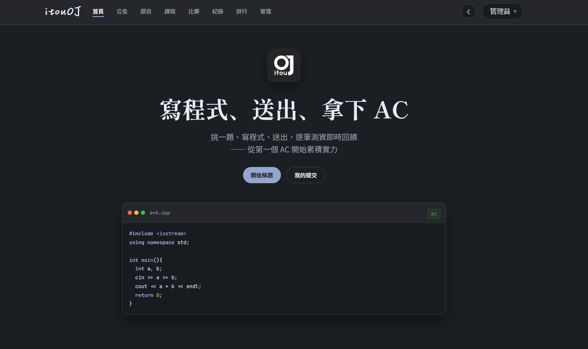

# itouOJ



自架的程式解題系統（OJ）。前後端用 Next.js 一體開發，評測引擎依語言分兩條路：C/C++/Python/JavaScript 走自架的 [sandbox-runner](sandbox-runner/README.md)（Linux namespaces + cgroup v2 + seccomp-bpf 從零刻的沙箱），Java 暫時繼續走 [Piston](https://github.com/engineer-man/piston)。

正式站：[oj.itousouta.me](https://oj.itousouta.me) ・ Android App：[app-v1.2.0](https://github.com/itousouta15/itouOJ/releases/tag/app-v1.2.0) ・ Windows 收件程式：[v1.3.2](https://github.com/itousouta15/itouOJ/releases/tag/v1.3.2)

## 目錄

- [功能](#功能)
- [技術架構](#技術架構)
- [專案結構](#專案結構)
- [本地開發](#本地開發)
- [手機 App（Android）](#手機-appandroid)
- [部署](#部署)
- [日常更新（改完程式碼後）](#日常更新改完程式碼後)
- [新增語言](#新增語言)

## 功能

- 帳號註冊 / 登入（第一個註冊的使用者自動成為管理員），支援 Google / Discord 登入
- 題目列表、Markdown + KaTeX 數學式題敘、範例測資、子題配分
- CodeMirror 程式碼編輯器（C++ / C / Python / Java / JavaScript），自動保存草稿
- 即時判題：AC / WA / TLE / MLE / RE / CE，逐筆測資顯示時間與記憶體
- 提交紀錄、排行榜、個人頁面
- 課程（題單）：一組題目 + 說明，使用者加入後追蹤解題進度，可設公開加入或加入代碼
- 公告：置頂公告、Markdown 內容，管理員可新增 / 編輯 / 刪除
- 管理後台：出題、測資編輯、時間 / 記憶體限制、公開 / 隱藏題目、課程與公告管理、**使用者管理（賦予 / 收回管理員身分）**
- 亮暗雙主題切換
- Android App（Capacitor 包裝）：可安裝的原生 App，App 內固定深色、與網站截然不同的版面與體驗（見「手機 App（Android）」）

## 技術架構

| 架構 | 技術 |
|----|------|
| 前端 + 後端 | Next.js 16（App Router）+ TypeScript + Tailwind CSS v4 |
| 資料庫 | SQLite + Prisma 7（better-sqlite3 driver adapter） |
| 手機 App | Capacitor 8（`android/` 原生專案，WebView 載入正式站）+ browser / local-notifications / status-bar / keyboard / splash-screen 外掛 |
| 評測引擎 | [sandbox-runner](sandbox-runner/README.md)（自架，C/C++/Python/JavaScript）+ Piston（Docker，Java） |
| 判題佇列 | in-process promise chain（`src/lib/judge.ts`），伺服器重啟自動恢復未完成的提交 |

```
                                  ┌──> sandbox-server (127.0.0.1:8090)
瀏覽器 ──> nginx ──> Next.js (:3000)─┤     C/C++/Python/JavaScript
                       │  SQLite   └──> Piston (127.0.0.1:2000, Docker)
                       │                 Java
```

`src/lib/execute.ts` 依語言分流，兩條路徑互相獨立（其中一邊掛掉不影響另一邊）。sandbox-runner 是這個專案自己刻的沙箱（namespace 隔離 + cgroup 資源限制 + seccomp syscall 白名單），細節、動機、架構圖見 [sandbox-runner/README.md](sandbox-runner/README.md)。

支援語言（版本對應 `src/lib/languages.ts`，時間 / 記憶體倍率是相對題目原始限制的放寬倍數）：

| 語言 | 版本 | 時間倍率 | 記憶體倍率 | 評測引擎 |
|----|----|:---:|:---:|----|
| C++ | GCC 10.2.0 | 1x | 1x | sandbox-runner |
| C | GCC 10.2.0 | 1x | 1x | sandbox-runner |
| Python | 3.12.0 | 3x | 1x | sandbox-runner |
| JavaScript | Node 20.11.1 | 3x | 2x | sandbox-runner |
| Java | 15.0.2 | 2x | 2x | Piston |

## 專案結構

```
src/
├─ app/               # Next.js App Router 頁面與 API routes
│  ├─ admin/          # 管理後台（題目、課程、公告、使用者）
│  ├─ api/            # 後端 API（auth、courses、submissions、run...）
│  ├─ problems/       # 題目列表 / 詳情
│  ├─ courses/        # 課程列表 / 詳情
│  ├─ announcements/  # 公告列表 / 詳情
│  ├─ submissions/    # 提交紀錄
│  ├─ ranking/        # 排行榜
│  └─ users/          # 使用者頁面
├─ components/        # 共用 React 元件
├─ lib/               # 判題邏輯、語言設定、共用工具（judge.ts、languages.ts...）
└─ generated/prisma/  # `prisma generate` 產出的 client（不手動編輯）

prisma/
├─ schema.prisma      # 資料庫 schema
└─ migrations/        # migration 歷史

deploy/                # 部署腳本與設定（見「部署」章節）

sandbox-runner/         # 自架評測沙箱（C/C++/Python/JavaScript 用），詳見其 README

client/                 # Windows 收件程式與打包工具，詳見 `client/README.md`

android/                # Capacitor Android 原生專案（手機 App 用），見「手機 App（Android）」
android/scripts/        # 圖示產生腳本（generate-icons.mjs，sharp 把 itouOJ.svg 轉成各密度 mipmap）
capacitor.config.ts     # Capacitor 設定（App 載入的網址、外掛行為）
```

## 本地開發

```bash
npm install                 # 會自動 prisma generate
npx prisma migrate dev      # 建立 SQLite 資料庫
npm run dev
```

`.env` 設定（參考）：

```env
DATABASE_URL="file:./dev.db"
AUTH_SECRET="<openssl rand -hex 32>"
PISTON_URL="http://localhost:2000"   # Piston 位址（Java 用）
SANDBOX_URL="http://localhost:8090"  # sandbox-runner 位址（C/C++/Python/JavaScript 用，不設也是這個預設值）
COOKIE_SECURE="0"                    # 上 HTTPS 後改 1

# Google 登入（選用；沒設定就不顯示 Google 按鈕）
GOOGLE_CLIENT_ID=""
GOOGLE_CLIENT_SECRET=""

# Discord 登入（選用；沒設定就不顯示 Discord 按鈕）
DISCORD_CLIENT_ID=""
DISCORD_CLIENT_SECRET=""

# APP_URL="https://oj.example.tw"    # 正式環境對外網址（組 OAuth redirect 用）
```

### Google 登入設定
到 [Google Cloud Console](https://console.cloud.google.com/apis/credentials) 建立「OAuth 用戶端 ID」（類型：網頁應用程式），授權重新導向 URI 填 `http://localhost:3000/api/auth/google/callback`。正式環境要再加一組 `https://<你的網域>/api/auth/google/callback` —— Google 不接受純 IP 或 http 的正式網址，所以正式站要先有網域 + HTTPS 才能開 Google 登入，並在 `.env` 設好 `APP_URL`。第一次用 Google 登入會自動建立帳號（沿用「第一個使用者是管理員」規則）。

### Discord 登入設定
到 [Discord Developer Portal](https://discord.com/developers/applications) 建立 Application，在 OAuth2 頁籤取得 Client ID / Client Secret，並在 Redirects 加上 `http://localhost:3000/api/auth/discord/callback`。正式環境要再加一組 `https://<你的網域>/api/auth/discord/callback`，並在 `.env` 設好 `APP_URL`。第一次用 Discord 登入一樣會自動建立帳號。

Piston 不在本機時，可用 SSH tunnel 接遠端的：`ssh -N -L 2000:localhost:2000 user@server`。

## 手機 App（Android）

App 是 Capacitor 包裝的 WebView：原生殼載入正式站（`https://oj.itousouta.me`），登入、OAuth、判題全部跟瀏覽器一樣走同一個網域。網頁端偵測到原生環境（`html[data-app]`，由 `src/app/layout.tsx` 的 themeInit 在首繪前設上）會套用 App 專屬外觀——**App 與網站是兩種不同的介面**：

| | 網站 | App |
|----|----|----|
| 主題 | 亮 / 暗可切換 | 固定深色 |
| 導覽 | 頂部 Navbar + Footer | 只留底部導覽列 |
| 首頁 | Hero + 程式碼視窗 + 宣傳區 | 精簡版面（隱藏 Hero 裝飾、宣傳區） |
| 寫程式 | 內嵌編輯器 | 點編輯器自動進全螢幕，收鍵盤自動變回 |

### 建置

需要 JDK 17+ 與 Android SDK（Android Studio 即可）：

```bash
npm install
npx cap sync android     # 把外掛與設定同步進 android/ 專案
npx cap open android     # 用 Android Studio 打開，可選實機或模擬器執行
# 或純 CLI 出 APK：
cd android && ./gradlew assembleRelease
```

Release 簽署走 `android/keystore.properties`（不入庫）；沒有它照樣能建 `assembleDebug`。圖示是 `android/scripts/generate-icons.mjs` 用 sharp 把 `itouOJ.svg` 轉成各密度的 launcher / round / adaptive foreground，改 LOGO 後重跑該腳本即可。

### 開發流程

App 預設載入正式站（`capacitor.config.ts` 的 `server.url`）。要連本機開發伺服器：

```bash
CAP_SERVER_URL=http://localhost:3000 npx cap sync android
adb reverse tcp:3000 tcp:3000
npx cap run android     # 或從 Android Studio 執行
```

### App 專屬功能

- **登入**：Google / Discord 登入在 App 內會開系統瀏覽器（Custom Tab）跑 OAuth，完成後關掉分頁自動登入——session 只寫進 App 自己的 WebView，不會污染手機瀏覽器裡網站的登入狀態（流程見 `src/lib/appOAuth.ts` 與 `/api/auth/app/*`）
- **鍵盤符號列**：全螢幕編輯器在手機鍵盤上方顯示兩排程式符號按鈕（`{ } ( ) [ ] ; : ' " # | & _ * % ^` 等 18 鍵），點擊插入游標處；鍵盤收起來自動隱藏
- **開賽提醒**：在 App 內看比賽頁時，會排一個開賽前 10 分鐘的本地通知（同一場不會重複排，排程記錄在裝置的 localStorage）
- **判題結果通知**：提交後停在判題頁，結果出爐（AC/WA/…）時推本地通知
- **狀態列**：跟隨 App 固定深色主題；頂部有漸層模糊遮罩
- **管理員**：底部導覽多一個「管理」入口
- 網頁端的手機體驗（全螢幕編輯器、吸底工具列、卡片列表、safe-area 適配）在一般手機瀏覽器同樣有效，但 App 專屬外觀只會在原生環境套用

> iOS 需要 macOS + Xcode 才能建置，目前只有 Android；之後有 Mac 再用同一個 `capacitor.config.ts` 跑 `npx cap add ios`。

## 部署

1. 伺服器啟動 Piston（**只綁 localhost，Piston 沒有認證機制**）：

   ```bash
   docker run --privileged -v /opt/piston-data:/piston --tmpfs /tmp:exec \
     -dit --restart=always -p 127.0.0.1:2000:2000 \
     -e PISTON_COMPILE_TIMEOUT=15000 -e PISTON_RUN_TIMEOUT=20000 \
     -e PISTON_OUTPUT_MAX_SIZE=33554432 \
     --memory=4g --memory-swap=4g --cpus=3 --pids-limit=1024 \
     --name piston_api ghcr.io/engineer-man/piston
   ```

   `--memory` / `--cpus` / `--pids-limit` 是限制**容器對主機的總資源上限**（跟評測本身的時間/記憶體限制是兩回事——單筆評測的限制是 `judge.ts` 依題目設定傳給 Piston，由內部 isolate/cgroup 逐筆強制執行，SIGKILL 後判 TLE/MLE）。沒有這層的話，Piston 容器預設可以吃光主機全部 CPU/RAM，isolate 出 bug 或題目限制設太大時會拖垮同一台主機上的 nginx / Next.js。數字要照主機規格調（範例是 4 核心 8GB 主機，留 1 核心給系統本身）。

   容器還在跑的話可以不重建直接套用：

   ```bash
   docker update --memory=4g --memory-swap=4g --cpus=3 --pids-limit=1024 piston_api
   ```

   原版 Piston 有三個問題會弄壞大測資（>100KB）甚至讓整個評測服務當掉，**每次重建容器後都要重新打補丁**（`docker restart` 不會弄丟，`docker rm` + `docker run` 會）：

   ```bash
   # 1) HTTP API body 上限預設 100KB，判題送不進大測資 → 調成 16MB

   docker exec piston_api sed -i \
     "s/body_parser.json()/body_parser.json({ limit: '16mb' })/; s/body_parser.urlencoded({ extended: true })/body_parser.urlencoded({ extended: true, limit: '16mb' })/" \
     /piston_api/src/index.js
 
   # 2) stdin 寫入後立刻 destroy()，緩衝區沒寫完就被丟掉，程式只收得到前 ~200KB → 拿掉那行

   docker exec piston_api sed -i '/proc.stdin.destroy();/d' /piston_api/src/job.js

   # 3) 使用者程式在 stdin 還沒寫完前就結束（提早 return / RE），父行程繼續寫入已關閉的 pipe
   #    會噴未捕捉的 EPIPE，整個 Piston process 直接崩潰（影響當下所有人的提交）→ 補一個空的 error handler
 
   docker exec piston_api sed -i \
     "s/proc.stdin.write(this.stdin);/proc.stdin.on('error', () => {}); proc.stdin.write(this.stdin);/" \
     /piston_api/src/job.js
   docker restart piston_api
   ```

   > `docker cp` 到這個容器的 `/tmp` 常常悄悄失敗（`/tmp` 掛的是 tmpfs），要塞檔案進容器的話改用 `/root` 之類的一般目錄。

   Piston 本身的沙箱只管資源（CPU/記憶體/時間）跟檔案系統範圍，**不管使用者程式碼能不能呼叫子程序**。submission 裡直接 `import subprocess` / `os.system`，就能在容器裡跑任意指令。

   現在正式判題只有 Java 走 Piston；C/C++/Python/JavaScript 已經換成 [sandbox-runner](sandbox-runner/README.md) 的核心層級防護，不依賴這裡的補丁。不過 Piston 內建的 Python 套件在「新增語言」步驟時還是會被安裝出來，所以這份 `sitecustomize.py` 仍然要放進去。

   補丁檔在 [deploy/piston-python-sitecustomize.py](deploy/piston-python-sitecustomize.py)。把它裝到 Python 套件的 `site-packages` 後，會用 `sys.addaudithook` 在直譯器層級擋掉：

   - `subprocess`
   - `os.system` / `os.popen` / `os.fork`
   - `ctypes`
   - `socket`

   audit hook 裝上去後使用者程式碼無法移除，比字串黑名單擋 `import` 紮實：

   ```bash
   scp deploy/piston-python-sitecustomize.py root@<server>:/root/sitecustomize.py
   ssh root@<server> "docker cp /root/sitecustomize.py piston_api:/piston/packages/python/3.12.0/lib/python3.12/site-packages/sitecustomize.py"
   ```

   這份檔案放在 `/piston/packages/...`，跟語言套件一樣是掛在 `/opt/piston-data` volume 上，`docker rm` + `docker run` 重建容器也不會弄丟（不像上面 3 個補丁要重打）；只有換 Python 版本或砍掉 `/opt/piston-data` 重裝套件時才需要重新放一次。

2. 安裝語言（照 `src/lib/languages.ts` 的版本）：

   ```bash
   curl -X POST http://localhost:2000/api/v2/packages -H 'Content-Type: application/json' \
     -d '{"language":"python","version":"3.12.0"}'
   # gcc 10.2.0 / java 15.0.2 / node 20.11.1 同理
   ```

3. 啟動 sandbox-runner（C/C++/Python/JavaScript 的評測引擎，取代 Piston）：

   ```bash
   apt install libseccomp-dev libmicrohttpd-dev libcjson-dev build-essential
   cd sandbox-runner && make
   cp deploy/sandbox-server.service /etc/systemd/system/
   systemctl daemon-reload && systemctl enable --now sandbox-server
   ```

   必須用 root 執行（建立 namespace/cgroup 需要的權限沒辦法給非特權使用者），只綁 `127.0.0.1:8090`。詳細架構、安全模型見 [sandbox-runner/README.md](sandbox-runner/README.md)。伺服器 `.env` 記得設 `SANDBOX_URL="http://127.0.0.1:8090"`（不設也會用這個預設值）。

4. 部署本體：`npm ci && npx prisma migrate deploy && npm run build`，用 systemd 跑 `next start`（範例在 [deploy/online-judge.service](deploy/online-judge.service)），前面掛 nginx 反向代理（[deploy/nginx-oj.conf](deploy/nginx-oj.conf)）。

5. 網域與 HTTPS（正式站 `https://oj.itousouta.me`）：DNS 加 A 記錄指到伺服器（Cloudflare 上選 DNS only），裝 `certbot python3-certbot-nginx` 後跑 `certbot --nginx -d oj.itousouta.me --redirect`（自動續簽由 certbot.timer 處理）。伺服器 `.env` 記得設 `APP_URL="https://oj.itousouta.me"`、`COOKIE_SECURE="1"` 和 Google / Discord 憑證。

## 日常更新（改完程式碼後）

```powershell
# 1. commit 修改（部署腳本打包的是已 commit 的內容，沒 commit 的改動不會上去）
git add -A
git commit -m "說明你改了什麼"

# 2. 一鍵部署：打包 → 上傳 → npm ci → migrate → build → 重啟服務
.\deploy\deploy.ps1

# 3. 同步到 GitHub
git push
```

- 想先在本地看效果：`npm run dev` 開 http://localhost:3000
- 評測功能要先接上伺服器：`ssh -N -L 2000:localhost:2000 -L 8090:localhost:8090 root@<server>`（2000 是 Piston、Java 用；8090 是 sandbox-runner，其他語言用）
- 改了 `prisma/schema.prisma` 的話，先在本地跑 `npx prisma migrate dev --name <名稱>` 產生 migration 再 commit，部署腳本會自動在伺服器套用

### App 更新流程

網頁端改動（App 外觀、鍵盤符號列、登入流程等）部署網站後 App 重開即生效，不用重裝。只有改到原生端（新增 Capacitor 外掛、圖示、版本號）才需要：

```powershell
npx cap sync android
cd android && .\gradlew.bat assembleRelease   # 產出 app/build/outputs/apk/release/app-release.apk
gh release create app-vX.Y.Z app-release.apk --title "itouOJ Android App X.Y" --notes "更新內容"
```

## 新增語言

依要不要走 sandbox-runner 分兩種：

- **走 Piston**（目前只有 Java）：Piston 裝套件（`POST /api/v2/packages`），在 `src/lib/languages.ts` 加一筆對應（檔名、版本、時間/記憶體倍率）。
- **走 sandbox-runner**：先在 `sandbox-runner/src/seccomp.c` 建立/擴充該語言的 seccomp 白名單（方法論見 [sandbox-runner/README.md](sandbox-runner/README.md#seccomp-白名單怎麼建的)），`sandbox-runner/src/server.c` 的 `LANGS` 表加一筆，再到 `src/lib/languages.ts` 加對應、`src/lib/execute.ts` 的 `SANDBOX_LANGUAGES` 集合加進去。