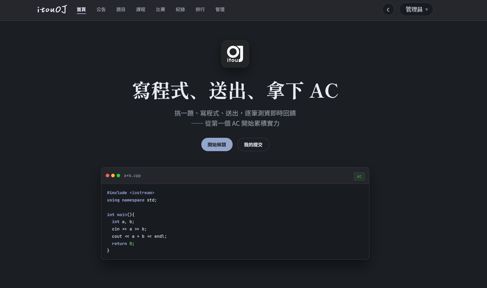

# itouOJ

一套可自行架設的 Online Judge，提供程式題、識讀練習、比賽、課程與離線收件。網站採用 Next.js；正式提交由自建的 Linux 沙箱判題。



[網站](https://oj.itousouta.me) · [下載版本（Android App／Windows 收件程式）](https://github.com/itousouta15/itouOJ/releases) · [貢獻指南](CONTRIBUTING.md)

## 能做什麼

| 功能 | 說明 |
| --- | --- |
| 程式題 | Markdown／數學式題敘、範例測資、標籤、子題配分、提交紀錄與排行榜；支援 C++、C、Python、JavaScript。 |
| 寫程式 | CodeMirror 編輯器、每題每語言的帳號草稿（網站與 Android App 同步，離線時保留本機草稿）與範例測試；手機可先備妥 stdin 再測試。桌機可左右拖曳調整題目與程式欄寬。 |
| Terminal | 桌機版可直接在終端機中逐行輸入、即時看輸出；支援 C++、C、Python、JavaScript|
| 識讀練習 | 選擇題即時對答案、詳解、題組進度與複習紀錄；不列入一般程式提交紀錄。 |
| 比賽與課程 | ICPC／IOI 計分、封榜與揭榜、參賽代碼、語言限制、PDF 題本；課程可整理題目與追蹤解題進度。 |
| 社群與管理 | 討論、題解、公告、站內訊息、個人檔案；管理後台可審核題目提案並管理題目、比賽、課程與使用者。 |
| 離線與行動裝置 | Windows 收件程式可在斷網比賽中保存提交、復網後補傳；Android App 使用 Capacitor，提供手機編輯器及原生通知。 |

可使用帳密註冊／登入；Google、Discord 登入及密碼重設信件可另外設定。識讀題庫中的 C／Python 125 題經 Bangye Wu 教授同意，供非營利教育用途使用，題目頁會標示來源。

## 系統怎麼運作

```text
瀏覽器／Android App
         │
         ▼
    Next.js（頁面與 API）──── SQLite／Prisma
         │
         ├─ 提交與「測試執行」
         │    └─ C／C++／Python／JavaScript → sandbox-server :8090
         │
         └─ 桌機 Terminal（持續執行、即時輸入輸出）
              └─ C／C++／Python／JavaScript → sandbox-interactive :8091
```

技術組成：**Next.js 16（App Router）／React 19／TypeScript／Tailwind CSS 4**、**SQLite／Prisma 7**、**CodeMirror 6**、**Capacitor 8**。提交由判題 worker 領取；`npm run dev` 會在開發模式啟動本機 worker，正式環境則使用 `deploy/online-judge-worker.service`。`sandbox-runner` 透過 Linux namespace、cgroup v2 與 seccomp 隔離程式碼。舊的 Java 提交紀錄仍可查看，但已停止接受新的 Java 提交。

編輯器顯示的語言版本定義在 [`src/lib/languages.ts`](src/lib/languages.ts)。自建沙箱的 C／C++ 實際編譯器取決於部署主機，請讓主機版本與網站顯示相符。

| 語言 | 編輯器標籤 | 判題 | 互動式 Terminal |
| --- | --- | --- | --- |
| C++ | GCC 10.2 | sandbox-runner | ✓ |
| C | GCC 10.2 | sandbox-runner | ✓ |
| Python | 3.12 | sandbox-runner | ✓ |
| JavaScript | Node 20 | sandbox-runner | ✓ |

Terminal 的輸入游標與程式輸出在同一個畫面：**Enter** 送出一行、**Shift＋Enter** 換行、**Ctrl＋D／EOF** 結束標準輸入，**Ctrl＋C／停止** 可終止執行。讀取到檔尾的程式要送出 EOF 才會結束。Terminal 最多執行兩分鐘，CPU 時間另依題目限制。詳見 [沙箱與互動服務說明](sandbox-runner/README.md)。

## 在本機啟動

需要 **Node.js 20.9 以上** 與 npm。網站和資料庫可在 Windows、macOS 或 Linux 開發；要真正執行使用者程式，還需要可連線的沙箱服務。

1. 安裝套件：

   ```sh
   npm ci
   ```

2. 在專案根目錄建立 `.env`。最精簡的本機設定如下；請換成自己產生的隨機密鑰：

   ```dotenv
   DATABASE_URL="file:./dev.db"
   AUTH_SECRET="請替換成至少 32 位元組的隨機字串"
   ```

   可以用 `node -e "console.log(require('node:crypto').randomBytes(32).toString('hex'))"` 產生密鑰。正式環境沒有 `AUTH_SECRET` 會拒絕啟動。`.env` 與資料庫檔不應提交到 Git。

3. 產生 Prisma Client、建立資料表並啟動網站：

   ```sh
   npm run generate
   npx prisma migrate dev
   npm run dev
   ```

   開啟 <http://localhost:3000>。新資料庫一開始沒有題目；可以在後台建立題目，或用 `node scripts/import-recognition-questions.mjs` 匯入隨專案提供的識讀題。

4. 註冊帳號後，若需要第一位管理員，在受信任的機器上執行（將 `YOUR_USERNAME` 換成帳號）：

   ```sh
   node scripts/bootstrap-admin.mjs YOUR_USERNAME
   ```

   此指令只允許在尚無管理員時使用。

網站可以先用來瀏覽題目、設計頁面；**提交、測試執行與 Terminal 都需要後端執行服務**。開發模式的帳密註冊／登入不要求 Cloudflare Turnstile，正式環境則會驗證。

### 本機執行程式

- **C／C++／Python／JavaScript 提交及測試**：安裝 Linux 的 [sandbox-runner](sandbox-runner/README.md)，預設連到 `127.0.0.1:8090`；也可用 `SANDBOX_URL` 指向可連線的沙箱。
- **桌機 Terminal**：另需 `sandbox-interactive`（`127.0.0.1:8091`）；它與一般測試執行是不同服務。Windows 使用 WSL2 的建置與啟動指令在 [sandbox-runner/README.md](sandbox-runner/README.md) 的「Windows 本機開發」段落；Linux 可使用 `sandbox-runner/deploy/sandbox-interactive.service`。

### 環境變數

| 變數 | 用途 |
| --- | --- |
| `DATABASE_URL` | SQLite 路徑；本機可用已被 `.gitignore` 排除的 `file:./dev.db`，既有部署腳本則預期正式資料庫為 `file:./oj.db`。 |
| `AUTH_SECRET` | 簽署登入 session；正式環境必填。 |
| `APP_URL` | 對外網址，用於 OAuth 回呼與站點連結；正式環境設定成 HTTPS 網址。 |
| `SANDBOX_URL` | 一般判題服務網址；預設為 `http://127.0.0.1:8090`。 |
| `INTERACTIVE_SANDBOX_URL` | 互動式 Terminal 服務網址；預設 `http://127.0.0.1:8091`。 |
| `JUDGE_WORKER_SECRET` | 正式環境判題 worker 呼叫內部 API 的密鑰。 |
| `TURNSTILE_SECRET`／`TURNSTILE_HOSTNAMES` | 正式環境帳密登入與註冊的 Turnstile 驗證密鑰、允許的主機名稱。前端 site key 目前在 `src/components/AuthForm.tsx` 設定；自行換網域部署時需對應調整。 |
| `GOOGLE_CLIENT_ID`／`GOOGLE_CLIENT_SECRET` | 選用的 Google 登入；需設定 `/api/auth/google/callback` 為回呼網址。 |
| `DISCORD_CLIENT_ID`／`DISCORD_CLIENT_SECRET` | 選用的 Discord 登入；需設定 `/api/auth/discord/callback` 為回呼網址。 |
| `RESEND_API_KEY`／`RESEND_FROM` | 選用的密碼重設信件。 |
| `OFFLINE_MODE=1` | 斷網比賽模式，停用對外 OAuth 登入等依賴網路的功能。 |
| `DEPLOY_SERVER` | `deploy/deploy.ps1` 使用的 SSH 伺服器位址（也可設同名環境變數）。 |

正式環境可用 `TURNSTILE_HOSTNAMES="oj.example.com"` 指定站點主機名稱；自訂網域需配置相符的 Turnstile widget 和 server secret。勿將真實密鑰寫進 README 或原始碼。

## 部署與更新

此專案的既有部署流程以 **Linux + systemd + nginx + SQLite** 為基礎：

1. 部署 [sandbox-runner](sandbox-runner/README.md) 到 `/opt/sandbox-runner`：`make` 建置 `jail` 和 `sandbox-server`，啟用 [`sandbox-server.service`](sandbox-runner/deploy/sandbox-server.service)。如需 Terminal，另外啟用 [`sandbox-interactive.service`](sandbox-runner/deploy/sandbox-interactive.service)。沙箱需 Linux namespace／cgroup v2，服務只應監聽本機位址。
2. 在 `/opt/online-judge` 安裝網站：`npm ci`、`npm run generate`、`npx prisma migrate deploy`、`npm run build`；正式 `.env` 設定 `DATABASE_URL="file:./oj.db"`，再設定 [`online-judge.service`](deploy/online-judge.service) 與 [`online-judge-worker.service`](deploy/online-judge-worker.service)，由 [nginx 設定](deploy/nginx-oj.conf)代理到 `:3000`。
3. 若從 Windows 更新既有伺服器，可設定 `DEPLOY_SERVER` 後執行 `./deploy/deploy.ps1`。腳本以 **已提交的 `HEAD`** 打包，在隔離目錄建置並驗證沙箱與網站；待判題中的提交結束，使用 SQLite `.backup` 建立一致性備份，依序更新沙箱、網站和 worker，健康檢查失敗時回復程式檔與服務。工作區未提交的修改不會被部署；需要更新 `jail` 時會一併重啟互動服務。備份保留在 `/opt/oj-deploy-backups/`。

正式提交與編輯器測試共用單一沙箱執行名額：正式提交優先，最多兩筆測試等待 15 秒，額滿回傳 503；正式提交若排隊逾時會重新排入判題佇列，不會因此被判系統錯誤。此排隊器以正式站單一 Next.js 伺服器程序為前提，若改為多實例部署，需將名額協調移到跨程序服務。部署腳本需要伺服器上有 `rsync`、`sqlite3`、`make`、GCC 及沙箱編譯依賴；資料庫備份可供回復，但新站開始服務後不會自動回滾資料庫，以免丟失新提交。

新部署請先確認服務設定檔中的 `/opt/...` 路徑與實際安裝位置一致，並提供 `JUDGE_WORKER_SECRET`、`AUTH_SECRET`、Turnstile 設定及正式站網址。更完整的沙箱建置、資源限制與驗證方式請看 [sandbox-runner 文件](sandbox-runner/README.md)。

## Android App 與 Windows 收件程式

**Android App**：由 Capacitor WebView 載入網站，行動版有分頁、全螢幕程式編輯器、鍵盤符號列與通知。原生專案在 `android/`；`capacitor.config.ts` 預設連到線上網站。安裝 Android SDK／JDK 後可用 `npx cap sync android`、`npx cap open android` 建置或測試；要切換開發網址可設 `CAP_SERVER_URL` 並重新同步。網站內容更新不需要重裝 App，原生資源或外掛變更則需要重建。

登入同一帳號後，題目編輯器會自動同步各語言的草稿。離線輸入先留在裝置上，連線後重試；兩台裝置同時修改、或首次遇到舊版瀏覽器草稿時，會要求選擇保留「此裝置」或「帳號版本」，不會自動覆蓋。草稿與正式提交是不同紀錄。舊版草稿原本不分帳號，若使用共用電腦，請確認舊版草稿屬於自己再選擇上傳。

**Windows 收件程式**：`client/` 下的獨立 .NET Framework 工具，供選手機在離線比賽寫程式、保存草稿與提交，復網後補傳；詳細設定、建置與使用流程請看 [client/README.md](client/README.md)。

## 專案目錄

```text
src/app/              頁面、API 與全站樣式
src/components/       編輯器、Terminal、題目／比賽 UI
src/lib/              認證、語言設定、判題與執行服務介面
prisma/               SQLite 資料模型、遷移與題庫資料
sandbox-runner/       Linux 沙箱、互動服務、整合測試與 systemd 設定
client/               Windows 離線收件程式
android/              Capacitor Android 原生專案
deploy/               網站部署腳本、nginx 與判題 worker 設定
scripts/              題庫匯入、管理與維護指令
```

開發前可執行 `npm run lint` 與 `npm run build`。問題回報與 PR 說明見 [CONTRIBUTING.md](CONTRIBUTING.md)。程式碼以 [MIT License](LICENSE) 授權；第三方授權提供的識讀題庫另依其使用條件。
